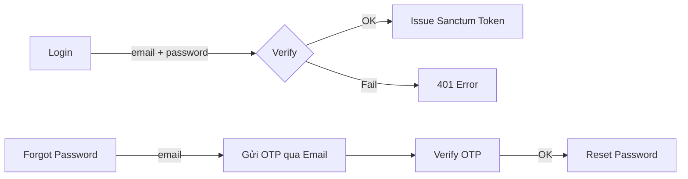
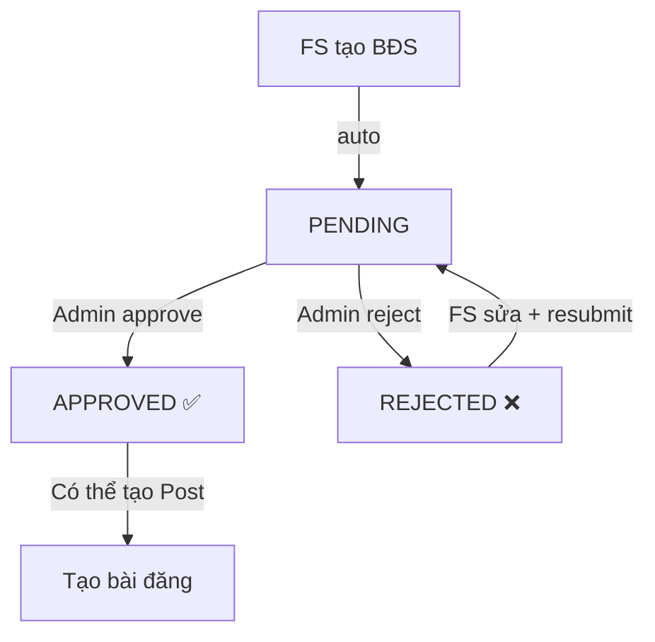
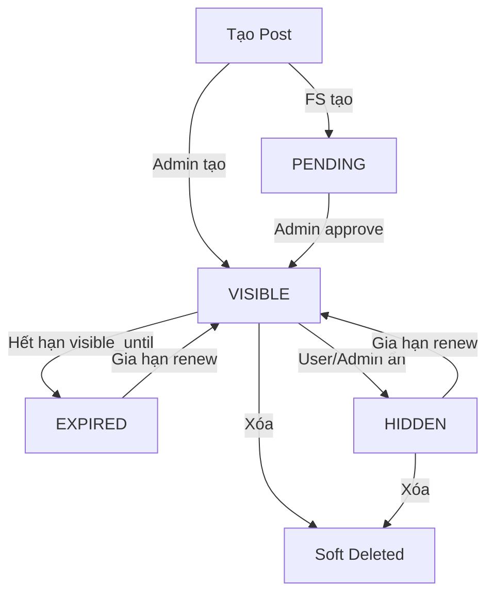
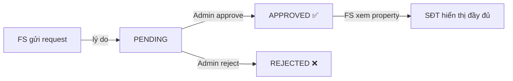
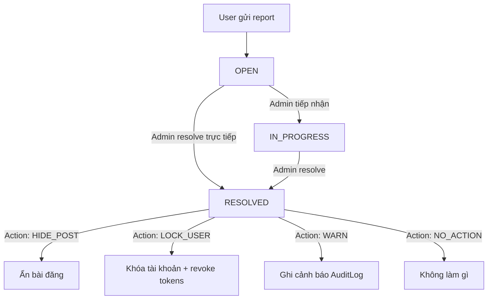

# 📋 TÀI LIỆU BÀN GIAO DỰ ÁN — HỆ THỐNG QUẢN LÝ BĐS

> **Phiên bản:** 1.0  
> **Ngày cập nhật:** 25/02/2026  
> **Repo:** `congdev0109/laravel-real-estate-bds`

---

## Mục lục

1. [Tổng quan dự án](#1-tổng-quan-dự-án)
2. [Tech Stack](#2-tech-stack)
3. [Cài đặt & Chạy dự án](#3-cài-đặt--chạy-dự-án)
4. [Cấu trúc thư mục](#4-cấu-trúc-thư-mục)
5. [Database Schema](#5-database-schema)
6. [Business Workflows](#6-business-workflows)
7. [RBAC & Phân quyền](#7-rbac--phân-quyền)
8. [API Endpoints](#8-api-endpoints)
9. [Admin Panel (Filament)](#9-admin-panel-filament)
10. [Quy tắc Code](#10-quy-tắc-code)
11. [Testing](#11-testing)
12. [Tài khoản Test](#12-tài-khoản-test)
13. [Tài liệu tham khảo](#13-tài-liệu-tham-khảo)

---

## 1. Tổng quan dự án

### Mô tả

Hệ thống **Quản lý Bất Động Sản (BĐS)** gồm 2 thành phần chính:

- **Web Admin** (`/admin`): Dùng Filament v3 để quản trị, kiểm duyệt BĐS, bài đăng, báo cáo, người dùng.
- **REST API** (`/api/v1`): Cung cấp API cho App mobile (React Native) và web client.

### Đối tượng sử dụng

| Vai trò          | Mô tả                                              |
| ---------------- | -------------------------------------------------- |
| **SUPER_ADMIN**  | Admin tổng hệ thống, quản lý toàn bộ               |
| **OFFICE_ADMIN** | Admin nghiệp vụ, duyệt BĐS, xử lý báo cáo          |
| **FIELD_STAFF**  | Nhân viên thị trường, tạo BĐS, xin xem SĐT chủ nhà |

### Mục tiêu

- Quản lý dữ liệu BĐS với workflow duyệt/từ chối
- Kiểm soát chặt dữ liệu nhạy cảm (SĐT chủ nhà, hồ sơ pháp lý)
- Phân quyền theo vai trò và scope theo khu vực địa lý
- Ghi nhật ký (audit log) mọi hành động quan trọng

---

## 2. Tech Stack

### Backend

| Công nghệ    | Phiên bản | Vai trò         |
| ------------ | --------- | --------------- |
| **PHP**      | >= 8.2    | Runtime         |
| **Laravel**  | 11.x      | Framework chính |
| **Filament** | 3.2+      | Admin Panel     |
| **MySQL**    | 8.x       | Database        |
| **Vite**     | 7.x       | Asset bundler   |

### Packages quan trọng

| Package                                      | Vai trò                                       |
| -------------------------------------------- | --------------------------------------------- |
| `laravel/sanctum` ^4.0                       | API Authentication (token-based)              |
| `spatie/laravel-permission` ^6.24            | RBAC (Role-Based Access Control)              |
| `bezhansalleh/filament-shield` ^3.9          | Tự động sinh permission cho Filament          |
| `dedoc/scramble` ^0.13                       | Auto-generate API Documentation (`/docs/api`) |
| `intervention/image` 3.0                     | Xử lý ảnh, tạo thumbnail                      |
| `spatie/laravel-settings` ^3.6               | Quản lý settings (General Settings)           |
| `filament/spatie-laravel-settings-plugin`    | Settings UI cho Filament                      |
| `dotswan/filament-map-picker` ^1.8           | Chọn vị trí trên map trong Filament           |
| `flowframe/laravel-trend` ^0.4               | Biểu đồ thống kê theo thời gian               |
| `amidesfahani/filament-tinyeditor` 2.0       | Rich text editor cho Filament                 |
| `diogogpinto/filament-auth-ui-enhancer` ^1.0 | Tùy chỉnh giao diện login Filament            |
| `visualbuilder/email-templates` 3.0          | Quản lý email template                        |

### Frontend (Admin)

| Công nghệ           | Phiên bản |
| ------------------- | --------- |
| Tailwind CSS        | 4.x       |
| Laravel Vite Plugin | 2.x       |

---

## 3. Cài đặt & Chạy dự án

### Yêu cầu hệ thống

- PHP >= 8.2 (+ extensions: `gd`, `mbstring`, `pdo_mysql`, `openssl`, `xml`)
- Composer >= 2.x
- Node.js >= 18.x + npm
- MySQL >= 8.0
- Git

### Bước cài đặt

```bash
# 1. Clone repository
git clone https://github.com/congdev0109/laravel-real-estate-bds.git
cd laravel-real-estate-bds

# 2. Cài đặt PHP dependencies
composer install

# 3. Tạo file .env
cp .env.example .env

# 4. Sinh APP_KEY
php artisan key:generate

# 5. Cài đặt Node dependencies
npm install

# 6. Build assets
npm run build
```

### Cấu hình `.env`

Mở file `.env` và cấu hình các giá trị sau:

```env
# App
APP_NAME="BDS Management"
APP_URL=http://localhost:8000

# Database (MySQL)
DB_CONNECTION=mysql
DB_HOST=127.0.0.1
DB_PORT=3306
DB_DATABASE=app_bds
DB_USERNAME=root
DB_PASSWORD=

# Mail (để gửi OTP, thông báo)
MAIL_MAILER=smtp
MAIL_HOST=smtp.gmail.com
MAIL_PORT=587
MAIL_USERNAME=your-email@gmail.com
MAIL_PASSWORD=your-app-password
MAIL_FROM_ADDRESS=noreply@bds.com
MAIL_FROM_NAME="${APP_NAME}"

# Queue
QUEUE_CONNECTION=database

# Filesystem
FILESYSTEM_DISK=local
```

### Database & Seed dữ liệu

```bash
# Tạo database 'app_bds' trong MySQL trước

# Chạy migration
php artisan migrate

# Seed dữ liệu mẫu (roles, admin users, fake data, email templates)
php artisan db:seed
```

> **Hoặc** nếu có file SQL sẵn: Import `app_bds.sql` vào MySQL.

### Chạy server

```bash
# Cách 1: Chỉ chạy server
php artisan serve --host=0.0.0.0 --port=8000

# Cách 2: Chạy đầy đủ (server + queue + logs + vite) — khuyến nghị
composer dev
```

### Kiểm tra

- **Admin Panel:** http://localhost:8000/admin
- **API Docs (Scramble):** http://localhost:8000/docs/api
- **API Ping:** http://localhost:8000/api/ping

---

## 4. Cấu trúc thư mục

```
app/
├── Console/
│   └── Commands/              # Artisan commands
│       ├── ExpireOldPosts.php          # Tự động expire các post hết hạn
│       ├── GenerateApiKey.php          # Tạo API key mới
│       └── ImportVietnamese...php      # Import đơn vị hành chính VN
│
├── Enums/                     # PHP 8.1 Enums cho status
│   ├── ApprovalStatus.php             # PENDING | APPROVED | REJECTED
│   ├── PostStatus.php                 # PENDING | VISIBLE | HIDDEN | EXPIRED
│   ├── ReportStatus.php               # OPEN | IN_PROGRESS | RESOLVED
│   └── RequestStatus.php              # PENDING | APPROVED | REJECTED
│
├── Filament/                  # Filament Admin Panel
│   ├── Pages/                         # Custom pages (Dashboard, Settings, Profile...)
│   ├── Resources/                     # CRUD Resources (15 resources)
│   └── Widgets/                       # Dashboard widgets (7 widgets)
│
├── Http/
│   ├── Controllers/
│   │   └── Api/V1/                    # API v1 Controllers (13 controllers)
│   ├── Middleware/
│   │   ├── ValidateApiKey.php         # Validate header X-API-KEY
│   │   ├── CheckUserNotLocked.php     # Chặn user bị locked
│   │   ├── SecurityHeadersMiddleware.php
│   │   └── VerifyCsrfToken.php
│   ├── Requests/                      # FormRequest validation (30+ files)
│   └── Resources/                     # API Resources / Transformers (10 files)
│
├── Jobs/                      # Queued jobs
├── Listeners/                 # Event listeners
├── Livewire/                  # Livewire components
│
├── Mail/                      # Mailable classes
│   ├── OtpMail.php                    # Gửi OTP đăng nhập
│   ├── PasswordResetOtpMail.php       # OTP quên mật khẩu
│   ├── PropertyApprovedMail.php       # Thông báo BĐS được duyệt
│   ├── PropertyRejectedMail.php       # Thông báo BĐS bị từ chối
│   └── PhoneRequestApprovedMail.php   # Thông báo request SĐT được duyệt
│
├── Models/                    # Eloquent Models (11 models)
│   ├── Area.php                       # Khu vực (tỉnh/huyện/xã) - self-referencing
│   ├── AuditLog.php                   # Nhật ký hành động
│   ├── Category.php                   # Loại BĐS (đất, nhà...)
│   ├── EmailLog.php                   # Log email đã gửi
│   ├── File.php                       # File upload (morphable)
│   ├── OwnerPhoneRequest.php          # Yêu cầu xem SĐT chủ nhà
│   ├── Post.php                       # Bài đăng
│   ├── Project.php                    # Dự án BĐS
│   ├── Property.php                   # Bất động sản (model chính)
│   ├── Report.php                     # Báo cáo vi phạm (morphable)
│   └── User.php                       # Người dùng
│
├── Observers/                 # Model observers
├── Policies/                  # Authorization policies (10 files)
│   ├── PropertyPolicy.php
│   ├── PostPolicy.php
│   ├── FilePolicy.php
│   ├── UserPolicy.php
│   ├── ReportPolicy.php
│   ├── OwnerPhoneRequestPolicy.php
│   ├── AuditLogPolicy.php
│   ├── PermissionPolicy.php
│   └── RolePolicy.php
│
├── Providers/                 # Service Providers
│
├── Services/                  # Business Logic Layer (9 services)
│   ├── AuditLogService.php            # Ghi audit log
│   ├── FileService.php                # Upload, thumbnail, reorder, delete
│   ├── ImageService.php               # Xử lý ảnh, resize
│   ├── OwnerPhoneRequestService.php   # Workflow xin xem SĐT
│   ├── PasswordResetOtpService.php    # OTP quên mật khẩu
│   ├── PostService.php                # CRUD & workflow bài đăng
│   ├── PropertyService.php            # CRUD & workflow BĐS
│   ├── ReportService.php              # Workflow báo cáo
│   └── UserService.php                # Quản lý user
│
├── Settings/                  # Spatie Settings classes
└── Traits/                    # Reusable Traits
    ├── HasApprovalWorkflow.php        # approve/reject logic chung
    ├── HasAreaScope.php               # Scope theo khu vực
    ├── CacheableModel.php             # Cache model queries
    ├── InvalidatesDashboardStats.php  # Clear dashboard cache khi data thay đổi
    └── HasUserMenuPreferences.php

config/                        # Config files (22 files)
database/
├── factories/                 # Model factories (7 files)
├── migrations/                # Database migrations (41 files)
├── seeders/                   # Database seeders (7 files)
│   ├── DatabaseSeeder.php             # Main seeder
│   ├── RolesAndPermissionsSeeder.php  # Tạo roles & permissions
│   ├── FakeDataSeeder.php             # Dữ liệu mẫu
│   └── SystemEmailTemplateSeeder.php  # Email templates
└── settings/                  # Settings migrations
docs/                          # Tài liệu dự án
├── flows/                     # Mô tả luồng nghiệp vụ (7 files)
├── ONBOARDING.md              # ← Tài liệu bạn đang đọc
└── ...
routes/
├── api.php                    # API routes (/api/v1/*)
├── web.php                    # Web routes (/admin, /)
└── console.php                # Console scheduled commands
tests/
├── Feature/                   # Feature tests
│   ├── Property/              # 4 test files
│   ├── Post/                  # 1 test file
│   └── Report/                # 1 test file
└── Unit/                      # Unit tests
```

---

## 5. Database Schema

### Tổng quan các bảng

| Bảng                                    | Mục đích                                             | Soft Delete |
| --------------------------------------- | ---------------------------------------------------- | ----------- |
| `users`                                 | Người dùng hệ thống                                  | ✅          |
| `areas`                                 | Đơn vị hành chính (tỉnh/huyện/xã) — self-referencing | ❌          |
| `projects`                              | Dự án BĐS (thuộc area)                               | ❌          |
| `categories`                            | Loại BĐS (đất nền, nhà phố...)                       | ❌          |
| `properties`                            | Bất động sản — model chính                           | ✅          |
| `posts`                                 | Bài đăng — gắn với property                          | ✅          |
| `owner_phone_requests`                  | Yêu cầu xem SĐT chủ nhà                              | ❌          |
| `reports`                               | Báo cáo vi phạm (morphable)                          | ❌          |
| `files`                                 | File upload (morphable)                              | ❌          |
| `audit_logs`                            | Nhật ký hành động                                    | ❌          |
| `email_logs`                            | Log email đã gửi                                     | ❌          |
| `roles` / `permissions` / `model_has_*` | Spatie RBAC tables                                   | ❌          |
| `personal_access_tokens`                | Sanctum tokens                                       | ❌          |
| `settings`                              | Spatie Settings                                      | ❌          |

### ERD — Quan hệ chính

```
┌──────────┐     1:N     ┌────────────┐     1:N     ┌────────┐
│  users   │────────────▶│ properties │────────────▶│ posts  │
│          │ created_by  │            │ property_id │        │
└──────────┘             └────────────┘             └────────┘
     │                        │  │
     │ 1:N                    │  │ 1:N (morph)
     │                        │  │
     │  ┌─────────────────────┘  ▼
     │  │               ┌──────────┐
     │  │               │  files   │  (owner_type + owner_id)
     │  │               └──────────┘
     │  │
     │  │ 1:N
     │  ▼
     │  ┌─────────────────────────┐
     │  │ owner_phone_requests    │
     │  │  property_id            │
     │  │  requester_id ──────────┤───▶ users
     │  │  reviewed_by ───────────┤───▶ users
     │  └─────────────────────────┘
     │
     │ 1:N              ┌───────────┐
     └──────────────────▶│  reports  │  (reportable_type + reportable_id)
       reporter_id       │           │  → Morph to: Post | Property | User
                         └───────────┘

┌──────────┐   self-ref   ┌──────────┐   1:N   ┌──────────┐
│  areas   │◀────────────│  areas   │────────▶│ projects │
│ (parent) │  parent_id  │ (child)  │ area_id │          │
└──────────┘             └──────────┘         └──────────┘
```

### Model `users`

| Cột                 | Type               | Mô tả                                           |
| ------------------- | ------------------ | ----------------------------------------------- |
| `id`                | bigint PK          |                                                 |
| `name`              | string             | Tên hiển thị                                    |
| `email`             | string unique      | Email đăng nhập                                 |
| `password`          | string (hashed)    | Mật khẩu                                        |
| `area_ids`          | json               | Mảng ID khu vực được gán (dùng cho FIELD_STAFF) |
| `is_locked`         | boolean            | Tài khoản bị khóa?                              |
| `phone`             | string nullable    | SĐT                                             |
| `dob`               | date nullable      | Ngày sinh                                       |
| `cccd_image`        | string nullable    | Ảnh CCCD                                        |
| `permanent_address` | string nullable    | Địa chỉ thường trú                              |
| `current_address`   | string nullable    | Địa chỉ hiện tại                                |
| `avatar_url`        | string nullable    | URL avatar                                      |
| `deleted_at`        | timestamp nullable | Soft delete                                     |

### Model `properties`

| Cột                      | Type                     | Mô tả                         |
| ------------------------ | ------------------------ | ----------------------------- |
| `id`                     | bigint PK                |                               |
| `title`                  | string                   | Tiêu đề BĐS                   |
| `description`            | text                     | Mô tả chi tiết                |
| `address`                | string                   | Địa chỉ                       |
| `area_id`                | FK → areas               | Khu vực (tỉnh/thành)          |
| `subdivision_id`         | FK → areas nullable      | Phân khu (quận/huyện)         |
| `project_id`             | FK → projects nullable   | Dự án                         |
| `category_id`            | FK → categories nullable | Loại BĐS                      |
| `owner_name`             | string                   | Tên chủ nhà                   |
| `owner_phone`            | string                   | SĐT chủ nhà ⚠️ **MASKED**     |
| `price`                  | decimal(15,2)            | Giá                           |
| `area`                   | decimal(10,2)            | Diện tích (m²)                |
| `width` / `length`       | decimal                  | Rộng / Dài                    |
| `road_width`             | decimal nullable         | Lộ giới                       |
| `bedrooms` / `bathrooms` | int                      | Số phòng ngủ / tắm            |
| `direction`              | string nullable          | Hướng                         |
| `floor`                  | int nullable             | Số tầng                       |
| `year_built`             | int nullable             | Năm xây                       |
| `lat` / `lng`            | decimal(10,8)            | Tọa độ GPS                    |
| `google_map_url`         | string nullable          | Link Google Maps              |
| `shape`                  | string nullable          | Hình dáng lô đất              |
| `location_type`          | string nullable          | Loại vị trí                   |
| `legal_docs`             | json nullable            | Hồ sơ pháp lý ⚠️ **HIDDEN**   |
| `legal_status`           | string nullable          | Tình trạng pháp lý            |
| `amenities`              | json nullable            | Tiện ích                      |
| `video_url`              | string nullable          | URL video                     |
| `approval_status`        | enum                     | PENDING / APPROVED / REJECTED |
| `approval_note`          | text nullable            | Ghi chú duyệt/từ chối         |
| `approved_by`            | FK → users nullable      | Admin duyệt                   |
| `approved_at`            | timestamp nullable       | Thời điểm duyệt               |
| `created_by`             | FK → users               | Người tạo                     |
| `deleted_at`             | timestamp nullable       | Soft delete                   |

### Model `posts`

| Cột             | Type               | Mô tả                                |
| --------------- | ------------------ | ------------------------------------ |
| `id`            | bigint PK          |                                      |
| `property_id`   | FK → properties    | BĐS liên quan                        |
| `status`        | enum               | PENDING / VISIBLE / HIDDEN / EXPIRED |
| `visible_until` | datetime nullable  | Hết hạn hiển thị                     |
| `renew_count`   | int default 0      | Số lần gia hạn                       |
| `created_by`    | FK → users         | Người tạo                            |
| `deleted_at`    | timestamp nullable | Soft delete                          |

### Model `owner_phone_requests`

| Cột            | Type                | Mô tả                         |
| -------------- | ------------------- | ----------------------------- |
| `id`           | bigint PK           |                               |
| `property_id`  | FK → properties     | BĐS cần xem SĐT               |
| `requester_id` | FK → users          | Người xin xem                 |
| `status`       | enum                | PENDING / APPROVED / REJECTED |
| `reason`       | text nullable       | Lý do xin xem                 |
| `admin_note`   | text nullable       | Ghi chú của admin             |
| `reviewed_by`  | FK → users nullable | Admin xử lý                   |
| `reviewed_at`  | timestamp nullable  |                               |

### Model `reports`

| Cột               | Type                | Mô tả                                    |
| ----------------- | ------------------- | ---------------------------------------- |
| `id`              | bigint PK           |                                          |
| `reportable_type` | string              | Morph type (Post / Property / User)      |
| `reportable_id`   | bigint              | Morph ID                                 |
| `reporter_id`     | FK → users          | Người báo cáo                            |
| `type`            | string              | Loại báo cáo                             |
| `content`         | text                | Nội dung                                 |
| `status`          | enum                | OPEN / IN_PROGRESS / RESOLVED            |
| `action`          | string nullable     | HIDE_POST / LOCK_USER / WARN / NO_ACTION |
| `admin_note`      | text nullable       |                                          |
| `resolved_by`     | FK → users nullable |                                          |
| `resolved_at`     | timestamp nullable  |                                          |

### Model `files`

| Cột              | Type                  | Mô tả                                     |
| ---------------- | --------------------- | ----------------------------------------- |
| `id`             | bigint PK             |                                           |
| `filename`       | string                | Tên file lưu trên disk                    |
| `original_name`  | string                | Tên file gốc                              |
| `path`           | string                | Đường dẫn trên storage                    |
| `thumbnail_path` | string nullable       | Đường dẫn thumbnail                       |
| `mime_type`      | string                | MIME type                                 |
| `size`           | int                   | Kích thước (bytes)                        |
| `purpose`        | string                | PROPERTY_IMAGE / LEGAL_DOC / AVATAR / ... |
| `visibility`     | string                | PUBLIC / PRIVATE                          |
| `owner_type`     | string nullable       | Morph type                                |
| `owner_id`       | bigint nullable       | Morph ID                                  |
| `uploaded_by`    | FK → users            | Người upload                              |
| `order`          | int default 0         | Thứ tự sắp xếp                            |
| `is_primary`     | boolean default false | Ảnh đại diện?                             |

### Model `audit_logs`

| Cột           | Type                | Mô tả                                        |
| ------------- | ------------------- | -------------------------------------------- |
| `id`          | bigint PK           |                                              |
| `actor_id`    | FK → users nullable | Người thực hiện                              |
| `action`      | string              | Hành động (approve_properties, lock_user...) |
| `description` | text nullable       | Mô tả thêm                                   |
| `target_type` | string              | Loại đối tượng                               |
| `target_id`   | bigint              | ID đối tượng                                 |
| `payload`     | json nullable       | Dữ liệu bổ sung                              |
| `ip_address`  | string nullable     | IP người thực hiện                           |
| `user_agent`  | string nullable     | User agent                                   |

### Model `areas`

| Cột             | Type                | Mô tả                              |
| --------------- | ------------------- | ---------------------------------- |
| `id`            | bigint PK           |                                    |
| `name`          | string              | Tên (Hà Nội, Quận Ba Đình...)      |
| `code`          | string nullable     | Mã hành chính                      |
| `api_code`      | int nullable        | Mã API                             |
| `division_type` | string nullable     | tỉnh / huyện / xã                  |
| `level`         | string              | province / district / ward         |
| `parent_id`     | FK → areas nullable | Self-referencing                   |
| `path`          | string nullable     | Full path (Hà Nội > Ba Đình > ...) |
| `order`         | int                 | Thứ tự                             |
| `is_active`     | boolean             | Có hiển thị?                       |

---

## 6. Business Workflows

### 6.1 Authentication (Auth)



**Luồng chi tiết:**

1. **Login** (`POST /api/v1/auth/login`):
    - Gửi `email` + `password` + header `X-API-KEY`
    - Trả về Sanctum Bearer Token
    - Rate limit: 5 requests/phút
    - Nếu user `is_locked = true` → 403 ACCOUNT_LOCKED

2. **Forgot Password** (`POST /api/v1/auth/forgot-password`):
    - Gửi `email` → Hệ thống gửi OTP 6 số qua email
    - Rate limit: 3 requests/phút

3. **Verify OTP** (`POST /api/v1/auth/verify-otp`):
    - Gửi `email` + `otp` → Xác thực OTP

4. **Reset Password** (`POST /api/v1/auth/reset-password`):
    - Gửi `email` + `otp` + `password` + `password_confirmation`

5. **Change Password** (`POST /api/v1/auth/change-password`):
    - Yêu cầu đăng nhập, gửi `current_password` + `password` + `password_confirmation`

6. **Logout** (`POST /api/v1/auth/logout`):
    - Xóa token hiện tại

### 6.2 Property Lifecycle (Vòng đời BĐS)



**Quy tắc:**

- BĐS mới luôn có `approval_status = PENDING`
- Chỉ OFFICE_ADMIN hoặc SUPER_ADMIN mới approve/reject
- Khi reject bắt buộc có `reason` (lý do)
- Chỉ BĐS `APPROVED` mới được tạo bài đăng (Post)
- Logic duyệt nằm trong `HasApprovalWorkflow` trait + `PropertyService`
- Mỗi lần approve/reject đều ghi `AuditLog`
- Gửi email thông báo cho FS khi approve/reject

**Code flow:**

```
Controller (AdminPropertyController)
  → Service (PropertyService::approve/reject)
    → Trait (HasApprovalWorkflow::approve/reject)
      → DB::transaction
      → AuditLog::log()
```

### 6.3 Post Lifecycle (Vòng đời bài đăng)



**Quy tắc:**

- Chỉ tạo Post cho BĐS đã `APPROVED`
- Không cho tạo trùng (1 Property chỉ có 1 Post VISIBLE/PENDING tại 1 thời điểm)
- Admin tạo → auto VISIBLE, FS tạo → PENDING
- `visible_until`: mặc định 30 ngày
- Gia hạn (`renew`): +30 ngày, giới hạn tối đa theo config `bds.max_post_renew` (default 3 lần)
- Scheduled command `ExpireOldPosts` tự động chuyển EXPIRED khi hết hạn
- Soft delete khi xóa

### 6.4 OwnerPhoneRequest (Xin xem SĐT chủ nhà)



**Quy tắc:**

- Chỉ FIELD_STAFF mới cần gửi request (Admin luôn thấy SĐT)
- **Chống trùng**: Không cho tạo request PENDING mới nếu đã có 1 request PENDING cho cùng property + requester
- Approval gắn theo cặp (requester_id + property_id)
- Logic masking nằm trong `Property::getOwnerPhoneAttribute()`:
    - Admin → Thấy đầy đủ
    - Creator → Thấy đầy đủ
    - FS có request APPROVED → Thấy đầy đủ
    - Còn lại → `012****789` (mask giữa)

### 6.5 Report (Báo cáo vi phạm)



**Quy tắc:**

- Report là morph (có thể report Post, Property, hoặc User)
- Action được giới hạn theo loại đối tượng:
    - Report **User** → `LOCK_USER`, `WARN`, `NO_ACTION`
    - Report **Post/Property** → `HIDE_POST`, `WARN`, `NO_ACTION`
- `LOCK_USER`: set `is_locked = true`, revoke tất cả Sanctum tokens
- `HIDE_POST`: chuyển status Post sang HIDDEN
- Toàn bộ trong `DB::transaction()`

### 6.6 File Upload

**Mô hình:**

- File sử dụng **Polymorphic Relationship** (owner_type + owner_id)
- Hai mức visibility: `PUBLIC` (disk: public) và `PRIVATE` (disk: local)
- Private files truy cập qua route download (kiểm tra auth)

**Tính năng:**

- Upload single / multiple files
- Tự động tạo thumbnail 300×300 cho ảnh (sử dụng Intervention Image)
- **Reorder**: Thay đổi thứ tự hiển thị (`order` column)
- **Set Primary**: Chọn ảnh đại diện (`is_primary` column, chỉ 1 file primary/owner)
- Purpose phân loại: `PROPERTY_IMAGE`, `LEGAL_DOC`, `AVATAR`, `REPORT_EVIDENCE`...

### 6.7 AuditLog

Hệ thống ghi lại các hành động quan trọng:

| Action                  | Mô tả               |
| ----------------------- | ------------------- |
| `create_property`       | Tạo BĐS             |
| `update_property`       | Cập nhật BĐS        |
| `approve_properties`    | Duyệt BĐS           |
| `reject_properties`     | Từ chối BĐS         |
| `create_post`           | Tạo bài đăng        |
| `approve_post`          | Duyệt bài đăng      |
| `hide_post`             | Ẩn bài đăng         |
| `renew_post`            | Gia hạn bài đăng    |
| `delete_post`           | Xóa bài đăng        |
| `create_phone_request`  | Tạo request xem SĐT |
| `approve_phone_request` | Duyệt request SĐT   |
| `reject_phone_request`  | Từ chối request SĐT |
| `create_report`         | Tạo báo cáo         |
| `resolve_report`        | Xử lý báo cáo       |
| `in_progress_report`    | Tiếp nhận báo cáo   |
| `lock_user`             | Khóa tài khoản      |
| `warn_user`             | Cảnh báo user       |
| `upload_file`           | Upload file         |
| `delete_file`           | Xóa file            |

**Cấu trúc log:**

```php
AuditLog::log(
    action: 'approve_properties',
    targetType: Property::class,
    targetId: $property->id,
    payload: ['note' => $note]  // optional
);
// Tự động lấy: actor_id, ip_address, user_agent từ request
```

---

## 7. RBAC & Phân quyền

### 7.1 Hệ thống phân quyền

- Sử dụng `spatie/laravel-permission` + `filament-shield`
- 3 roles: `SUPER_ADMIN`, `OFFICE_ADMIN`, `FIELD_STAFF`
- Permissions theo pattern: `{action}_{entity}` (view_any_property, create_post...)

### 7.2 Ma trận quyền theo Role

| Tính năng                         | SUPER_ADMIN  |         OFFICE_ADMIN          |       FIELD_STAFF       |
| --------------------------------- | :----------: | :---------------------------: | :---------------------: |
| **Quản lý User**                  |   ✅ CRUD    | ✅ CRUD (trừ Role/Permission) |           ❌            |
| **Quản lý Role/Permission**       |      ✅      |              ❌               |           ❌            |
| **Xem tất cả BĐS**                |      ✅      |              ✅               |     🔒 Chỉ area_ids     |
| **Tạo BĐS**                       |      ✅      |              ✅               |           ✅            |
| **Duyệt/Từ chối BĐS**             |      ✅      |              ✅               |           ❌            |
| **Xem SĐT chủ nhà**               | ✅ Luôn thấy |         ✅ Luôn thấy          | 🔒 Cần request approved |
| **Xem legal_docs**                |      ✅      |              ✅               |   🔒 Chỉ BĐS mình tạo   |
| **Quản lý bài đăng**              |      ✅      |              ✅               |      ✅ (của mình)      |
| **Duyệt request SĐT**             |      ✅      |              ✅               |           ❌            |
| **Xử lý Report**                  |      ✅      |              ✅               |           ❌            |
| **Khóa/Mở khóa User**             |      ✅      |              ✅               |           ❌            |
| **Xem Audit Log**                 |      ✅      |              ❌               |           ❌            |
| **Quản lý Area/Category/Project** |      ✅      |              ✅               |      ❌ (chỉ xem)       |
| **Upload file**                   |      ✅      |              ✅               |           ✅            |
| **Admin Panel**                   |      ✅      |              ✅               |      ✅ (giới hạn)      |

### 7.3 Scope theo khu vực (Area Scope)

- FIELD_STAFF có trường `area_ids` (JSON array chứa IDs khu vực được gán)
- Khi query Properties, scope `withinUserAreas` được áp dụng:
    - Admin → Xem tất cả
    - FS → Chỉ xem property có `area_id IN user.area_ids` HOẶC `created_by = user.id`
- Logic nằm trong `Property::scopeWithinUserAreas()`

### 7.4 Middleware API

Tất cả API routes có middleware chain:

```
api.key          → Validate header X-API-KEY
throttle:60,1    → Rate limit 60 req/phút
auth:sanctum     → Bearer token authentication (routes protected)
CheckUserNotLocked → Chặn user bị khóa (403 ACCOUNT_LOCKED)
role:SUPER_ADMIN|OFFICE_ADMIN → Routes admin only
```

---

## 8. API Endpoints

### Base URL: `/api/v1`

### Headers bắt buộc

```
X-API-KEY: bds-TTMIxTtE1H6MXIypiiBoa1IfpPA3D0Nb
Content-Type: application/json
Accept: application/json
Authorization: Bearer {token}  (routes cần auth)
```

### 8.1 Public Routes (Không cần auth)

| Method | Endpoint                | Mô tả                               |
| ------ | ----------------------- | ----------------------------------- |
| `POST` | `/auth/login`           | Đăng nhập (rate: 5/min)             |
| `POST` | `/auth/forgot-password` | Gửi OTP quên mật khẩu (rate: 3/min) |
| `POST` | `/auth/verify-otp`      | Xác thực OTP (rate: 5/min)          |
| `POST` | `/auth/reset-password`  | Đặt lại mật khẩu (rate: 5/min)      |
| `GET`  | `/dicts/areas`          | Danh sách khu vực                   |
| `GET`  | `/dicts/categories`     | Danh sách loại BĐS                  |
| `GET`  | `/dicts/projects`       | Danh sách dự án                     |

### 8.2 Protected Routes (Cần auth + user không bị khóa)

#### Auth & Profile

| Method | Endpoint                | Mô tả                   |
| ------ | ----------------------- | ----------------------- |
| `POST` | `/auth/refresh`         | Refresh token           |
| `POST` | `/auth/logout`          | Đăng xuất               |
| `POST` | `/auth/change-password` | Đổi mật khẩu            |
| `GET`  | `/me`                   | Thông tin user hiện tại |
| `PUT`  | `/me`                   | Cập nhật profile        |

#### Properties (BĐS)

| Method   | Endpoint           | Mô tả                         |
| -------- | ------------------ | ----------------------------- |
| `GET`    | `/properties`      | Danh sách BĐS (có scope area) |
| `GET`    | `/properties/map`  | BĐS trên bản đồ               |
| `POST`   | `/properties`      | Tạo BĐS mới (auto PENDING)    |
| `GET`    | `/properties/{id}` | Chi tiết BĐS                  |
| `PUT`    | `/properties/{id}` | Cập nhật BĐS                  |
| `DELETE` | `/properties/{id}` | Xóa BĐS (soft delete)         |
| `GET`    | `/me/properties`   | BĐS của tôi                   |

#### Posts (Bài đăng)

| Method   | Endpoint            | Mô tả                           |
| -------- | ------------------- | ------------------------------- |
| `GET`    | `/posts`            | Danh sách bài đăng              |
| `POST`   | `/posts`            | Tạo bài đăng (cần BĐS APPROVED) |
| `PATCH`  | `/posts/{id}`       | Cập nhật bài đăng               |
| `DELETE` | `/posts/{id}`       | Xóa bài đăng                    |
| `POST`   | `/posts/{id}/renew` | Gia hạn bài đăng                |
| `POST`   | `/posts/{id}/hide`  | Ẩn bài đăng                     |
| `GET`    | `/me/posts`         | Bài đăng của tôi                |

#### Owner Phone Requests

| Method | Endpoint                                | Mô tả                         |
| ------ | --------------------------------------- | ----------------------------- |
| `POST` | `/properties/{id}/owner-phone-requests` | Xin xem SĐT chủ nhà           |
| `GET`  | `/me/owner-phone-requests`              | Danh sách request SĐT của tôi |

#### Files

| Method   | Endpoint                  | Mô tả              |
| -------- | ------------------------- | ------------------ |
| `POST`   | `/files`                  | Upload single file |
| `POST`   | `/files/multiple`         | Upload nhiều files |
| `PUT`    | `/files/reorder`          | Sắp xếp lại thứ tự |
| `POST`   | `/files/{id}/set-primary` | Đặt làm ảnh chính  |
| `GET`    | `/files/{id}/download`    | Download file      |
| `DELETE` | `/files/{id}`             | Xóa file           |

#### Reports

| Method | Endpoint   | Mô tả               |
| ------ | ---------- | ------------------- |
| `POST` | `/reports` | Tạo báo cáo vi phạm |

#### Emails

| Method | Endpoint                         | Mô tả                          |
| ------ | -------------------------------- | ------------------------------ |
| `POST` | `/emails/send-otp`               | Gửi OTP                        |
| `POST` | `/emails/property-approved`      | Gửi email BĐS đã duyệt         |
| `POST` | `/emails/property-rejected`      | Gửi email BĐS bị từ chối       |
| `POST` | `/emails/phone-request-approved` | Gửi email request SĐT đã duyệt |
| `POST` | `/emails/custom`                 | Gửi email tùy chỉnh            |

### 8.3 Admin Routes (Cần role SUPER_ADMIN hoặc OFFICE_ADMIN)

Prefix: `/admin`

| Method                | Endpoint                                   | Mô tả                 |
| --------------------- | ------------------------------------------ | --------------------- |
| `GET`                 | `/admin/properties`                        | Danh sách BĐS (admin) |
| `POST`                | `/admin/properties/{id}/approve`           | Duyệt BĐS             |
| `POST`                | `/admin/properties/{id}/reject`            | Từ chối BĐS           |
| `GET`                 | `/admin/owner-phone-requests`              | Danh sách request SĐT |
| `POST`                | `/admin/owner-phone-requests/{id}/approve` | Duyệt request SĐT     |
| `POST`                | `/admin/owner-phone-requests/{id}/reject`  | Từ chối request SĐT   |
| `GET`                 | `/admin/reports`                           | Danh sách báo cáo     |
| `POST`                | `/admin/reports/{id}/resolve`              | Xử lý báo cáo         |
| `GET/POST/PUT/DELETE` | `/admin/users`                             | CRUD Users            |
| `POST`                | `/admin/users/{id}/lock`                   | Khóa user             |
| `POST`                | `/admin/users/{id}/unlock`                 | Mở khóa user          |
| `GET`                 | `/admin/audit-logs`                        | Xem audit log         |
| `POST`                | `/admin/areas`                             | Tạo khu vực           |
| `PUT`                 | `/admin/areas/{id}`                        | Cập nhật khu vực      |
| `POST`                | `/admin/categories`                        | Tạo loại BĐS          |
| `PUT`                 | `/admin/categories/{id}`                   | Cập nhật loại BĐS     |
| `POST`                | `/admin/projects`                          | Tạo dự án             |
| `PUT`                 | `/admin/projects/{id}`                     | Cập nhật dự án        |

### 8.4 API Documentation

API docs tự động sinh bởi **Dedoc Scramble**: http://localhost:8000/docs/api

---

## 9. Admin Panel (Filament)

### URL: `/admin`

### 9.1 Filament Resources (15 resources)

| Resource                      | Model             | Chức năng chính                                    |
| ----------------------------- | ----------------- | -------------------------------------------------- |
| **UserResource**              | User              | CRUD users, gán role, gán area_ids, lock/unlock    |
| **PropertyResource**          | Property          | CRUD BĐS, approve/reject actions, upload ảnh/hồ sơ |
| **PostResource**              | Post              | CRUD bài đăng, approve/hide/renew actions          |
| **OwnerPhoneRequestResource** | OwnerPhoneRequest | Xem/approve/reject request SĐT                     |
| **ReportResource**            | Report            | Xem/resolve report (HIDE_POST, LOCK_USER, WARN)    |
| **FileResource**              | File              | Quản lý files đã upload                            |
| **AuditLogResource**          | AuditLog          | Xem nhật ký hành động (read-only)                  |
| **AreaResource**              | Area              | CRUD khu vực (tỉnh/thành phố)                      |
| **SubdivisionResource**       | Area              | CRUD phân khu (quận/huyện/xã)                      |
| **ProvinceResource**          | Area              | Xem danh sách tỉnh                                 |
| **ProjectResource**           | Project           | CRUD dự án BĐS                                     |
| **CategoryResource**          | Category          | CRUD loại BĐS                                      |
| **RoleResource**              | Role              | Quản lý roles (chỉ SUPER_ADMIN)                    |
| **PermissionResource**        | Permission        | Quản lý permissions (chỉ SUPER_ADMIN)              |
| **EmailTemplateResource**     | EmailTemplate     | Quản lý email templates                            |

### 9.2 Filament Pages

| Page                 | Mô tả                            |
| -------------------- | -------------------------------- |
| `Dashboard`          | Trang chủ admin với widgets      |
| `Settings`           | Cài đặt chung (General Settings) |
| `ManageMailSettings` | Cấu hình SMTP email              |
| `MyProfile`          | Trang profile cá nhân            |
| `PostmanGenerator`   | Xuất Postman collection          |
| `StaticProvinces`    | Xem danh sách tỉnh thành         |
| `StaticSubdivisions` | Xem danh sách quận huyện         |

### 9.3 Dashboard Widgets (7 widgets)

| Widget                   | Mô tả                                    |
| ------------------------ | ---------------------------------------- |
| `WelcomeHeaderWidget`    | Lời chào + avatar                        |
| `StatsSummary`           | Tổng quan số liệu (BĐS, users, posts...) |
| `StaffStatsOverview`     | Thống kê theo nhân viên                  |
| `PendingActionsWidget`   | Các item chờ xử lý                       |
| `PropertyStatusChart`    | Biểu đồ trạng thái BĐS                   |
| `PostActivityChart`      | Biểu đồ hoạt động bài đăng               |
| `RecentActivitiesWidget` | Hoạt động gần đây                        |

---

## 10. Quy tắc Code

### 10.1 PHP Standards

```php
<?php

declare(strict_types=1);  // ← BẮT BUỘC mọi file PHP

namespace App\Services;

class MyService
{
    // Type hint bắt buộc cho params + return
    public function process(int $id, string $name): array
    {
        //...
    }
}
```

- **PSR-12**: Tuân thủ chuẩn trình bày code
- **PHP 8.2+**: Sử dụng typed properties, constructor promotion, match expression, Enum
- Đặt tên biến/method bằng tiếng Anh, rõ ý nghĩa

### 10.2 Architecture Flow

```
Request → Middleware → Controller → FormRequest → Service → Model
                                                      ↓
                                            AuditLog::log()
                                                      ↓
                                              API Resource (response)
```

**Nguyên tắc:**

- ❌ **KHÔNG** viết logic nghiệp vụ trong Controller
- ❌ **KHÔNG** validate trong Controller (dùng FormRequest)
- ❌ **KHÔNG** query DB trong Blade
- ❌ **KHÔNG** dùng `$request->all()` → Dùng `$request->validated()`
- ❌ **KHÔNG** hard-code config
- ✅ Dùng **Dependency Injection**, không `new Service()` trong Controller
- ✅ Thao tác quan trọng → `DB::transaction()`
- ✅ Mọi response API → qua **API Resource** (không trả Model trực tiếp)
- ✅ Mọi Policy phải được đăng ký cho Resource/API tương ứng

### 10.3 Naming Conventions

| Item         | Convention              | Ví dụ                           |
| ------------ | ----------------------- | ------------------------------- |
| Model        | PascalCase, số ít       | `Property`, `OwnerPhoneRequest` |
| Controller   | PascalCase + Controller | `PropertyController`            |
| Service      | PascalCase + Service    | `PropertyService`               |
| FormRequest  | PascalCase + Request    | `StorePropertyRequest`          |
| API Resource | PascalCase + Resource   | `PropertyResource`              |
| Migration    | snake_case              | `create_properties_table`       |
| Enum         | PascalCase              | `ApprovalStatus`                |
| Trait        | PascalCase              | `HasApprovalWorkflow`           |
| Policy       | PascalCase + Policy     | `PropertyPolicy`                |

### 10.4 Data Masking ⚠️

Masking được implement ở **Model Accessor** (KHÔNG phải ở frontend):

```php
// Property.php
public function getOwnerPhoneAttribute(?string $value): ?string
{
    // Admin → full
    // Creator → full
    // FS có approved request → full
    // Còn lại → masked: 012****789
}

public function getLegalDocsAttribute(mixed $value): mixed
{
    // Admin → full
    // Creator → full
    // Còn lại → null (hidden)
}
```

---

## 11. Testing

### Chạy test

```bash
# Chạy tất cả tests
php artisan test

# Hoặc
composer test

# Chạy test theo folder
php artisan test --filter=Property

# Chạy 1 test cụ thể
php artisan test --filter=PropertyApprovalTest
```

### Danh sách test hiện có

| File                                               | Test cases | Mô tả                             |
| -------------------------------------------------- | ---------- | --------------------------------- |
| `tests/Feature/Property/PropertyApprovalTest.php`  | 3-4 tests  | Workflow approve/reject BĐS       |
| `tests/Feature/Property/PropertyAreaScopeTest.php` | 3-4 tests  | Scope theo area cho FS            |
| `tests/Feature/Property/PropertyMaskingTest.php`   | 4-5 tests  | Masking owner_phone & legal_docs  |
| `tests/Feature/Property/OwnerPhoneRequestTest.php` | 3-4 tests  | Workflow xin xem SĐT, chống trùng |
| `tests/Feature/Post/PostWorkflowTest.php`          | 3-4 tests  | Lifecycle bài đăng                |
| `tests/Feature/Report/ReportResolveTest.php`       | 3-4 tests  | Resolve report (hide/lock/warn)   |

### Cấu hình test

- File: `phpunit.xml`
- Database: Sử dụng SQLite in-memory hoặc MySQL test database
- Mỗi test sẵn có base TestCase với helper tạo user + assign role

---

## 12. Tài khoản Test

### Admin Panel (`/admin`)

| Vai trò          | Email                                       | Password   |
| ---------------- | ------------------------------------------- | ---------- |
| **SUPER_ADMIN**  | `admin@example.com`                         | `password` |
| **OFFICE_ADMIN** | `manager@example.com`                       | `password` |
| **FIELD_STAFF**  | `staff@example.com`                         | `password` |
| **FIELD_STAFF**  | `staff1@example.com` → `staff5@example.com` | `password` |

### API Key

```
X-API-KEY: bds-TTMIxTtE1H6MXIypiiBoa1IfpPA3D0Nb
```

### Tạo API Key mới

```bash
php artisan make:api-key
```

### Postman Collection

File Postman có sẵn trong root project:

- `BDS_Complete_API.postman_collection.json` — Collection đầy đủ
- `BDS_Documented.postman_collection.json` — Collection có documentation

---

## 13. Tài liệu tham khảo

### Tài liệu trong project

| File                                              | Nội dung                        |
| ------------------------------------------------- | ------------------------------- |
| `docs/flows/mota_chucnang.md`                     | Mô tả chức năng tổng quan       |
| `docs/flows/01-auth-va-trang-thai-tai-khoan.md`   | Luồng Auth                      |
| `docs/flows/02-vong-doi-bds-tao-duyet-tu-choi.md` | Luồng BĐS                       |
| `docs/flows/03-xem-bds-scope-masking.md`          | Scope & Masking                 |
| `docs/flows/04-xin-quyen-xem-sdt-chu.md`          | OwnerPhoneRequest               |
| `docs/flows/05-vong-doi-bai-dang-post.md`         | Luồng Post                      |
| `docs/flows/06-bao-cao-va-kiem-duyet.md`          | Reports                         |
| `docs/REACT_NATIVE_GUIDE.md`                      | Hướng dẫn React Native App      |
| `docs/EMAIL_CONFIGURATION.md`                     | Cấu hình email                  |
| `docs/PROGRESS_REPORT.md`                         | Báo cáo tiến độ                 |
| `AGENTS.md`                                       | Coding guidelines cho AI agents |

### Liên kết

- **API Docs (Scramble):** http://localhost:8000/docs/api
- **OpenAPI Spec:** `openapi.yaml` (trong root)

---

## Artisan Commands hữu ích

```bash
# Tạo API key
php artisan make:api-key

# Expire các post hết hạn
php artisan posts:expire

# Import đơn vị hành chính VN
php artisan areas:import

# Export areas ra JSON
php artisan areas:export

# Clear cache
php artisan cache:clear
php artisan config:clear
php artisan view:clear

# Chạy queue
php artisan queue:work

# Seed lại dữ liệu mẫu
php artisan db:seed --class=FakeDataSeeder
```

---

> **💡 Tips cho dev mới:**
>
> 1. Đọc `docs/flows/mota_chucnang.md` trước để hiểu tổng quan nghiệp vụ
> 2. Xem API docs tại `/docs/api` để hiểu request/response format
> 3. Import Postman collection để test API nhanh
> 4. Chạy `php artisan test` để đảm bảo code chạy đúng sau khi sửa
> 5. Luôn kiểm tra Policy trước khi thêm endpoint/resource mới
> 6. Khi sửa logic masking → chạy lại `PropertyMaskingTest`
